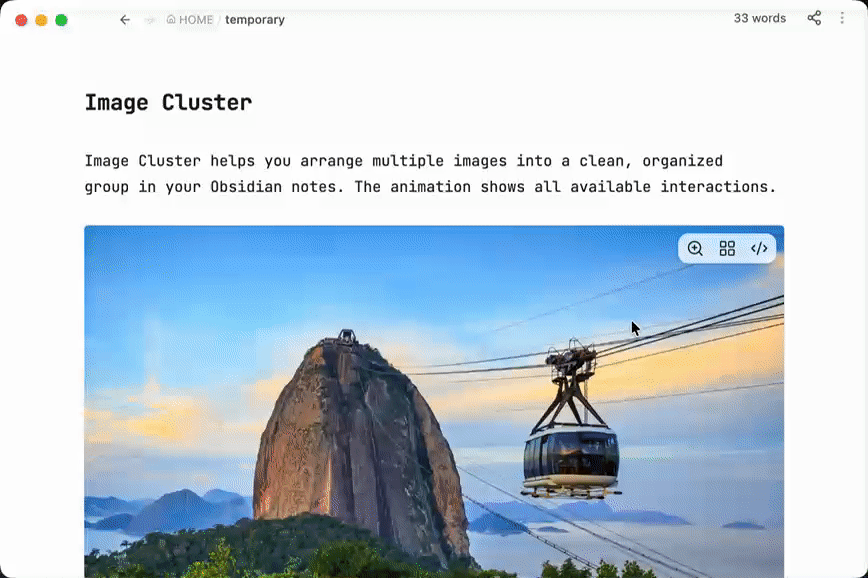

	
	<!-- last commit -->
	
	<!-- release -->
	
	<!-- license -->
	
	<!-- stars -->
	

 

中文 ｜ <a href="../README.md">English</a>

# Image Cluster

Image Cluster 可以将笔记中的多张图片整齐地组合在一起，让内容更美观、更有条理。动图展示了插件的全部操作。

## 安装

### 在 Obsidian 中安装

1. 打开 Obsidian 的**设置 → 第三方插件**。
2. 点击**浏览**，搜索 **Image Cluster**。
3. 点击**安装**，然后启用插件。

### 手动安装

1. 打开 [Image Cluster 下载页面](https://community.obsidian.md/plugins/image-cluster)。
2. 下载插件，并按照页面上的说明完成安装。
3. 打开 Obsidian 的**设置 → 第三方插件**，启用 **Image Cluster**。

## 进阶操作说明

下面这些设置会自动保存在 `imgs` 图片组的第一行。如果需要更精细地调整样式，也可以手动修改对应的值。

| 变量 | 作用 | 初始值 | 可用值 |
| --- | --- | --- | --- |
| `size` | 图片的宽度和高度 | `150` | `50`–`500` 像素 |
| `gap` | 图片之间的间距 | `8` | `0`–`50` 像素 |
| `radius` | 图片圆角大小 | `10` | `0`–`50` 像素 |
| `shadow` | 是否显示图片阴影 | `false` | `true` 或 `false` |
| `border` | 是否显示图片边框 | `false` | `true` 或 `false` |
| `hidden` | 是否模糊图片并禁止点击查看 | `false` | `true` 或 `false` |
| `limit` | 是否最多显示三行图片，点击后可展开 | `false` | `true` 或 `false` |
| `padding-left` | 图片组向右移动的距离 | `0` | 不小于 `0` 的像素值 |
